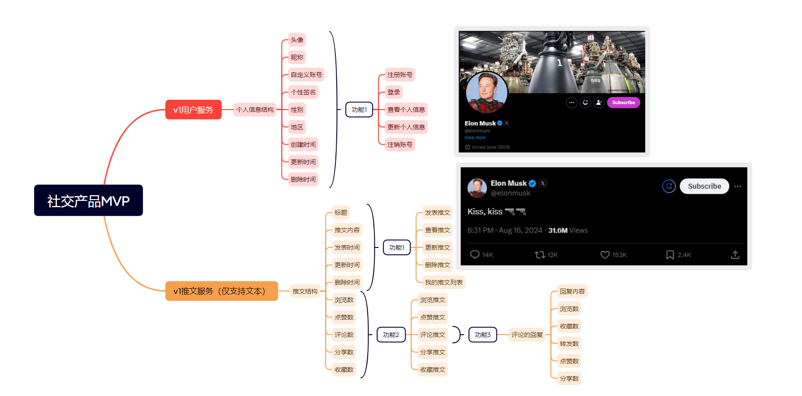

# go-zero-demo
```
基于go-zero框架的社交产品demo,仅供参考、交流、学习！！！
```
在线实时文档：https://www.yuque.com/ngyhd/sdqiox/hkcfrvfous3wxu8v

## 背景
张三是一位商业大亨，他非常看好国内的社交产品赛道，想要造一款属于的社交产品，于是他找到了负责软件研发的小明。
小明跟张三一拍即合，小明决定跟张三大干一番。
## 社交产品MVP版本
张三希望以最快的时间看到一款属于自己的社交产品于是有了接下来的需求  
### 1.身份认证系统。  
注册、登录、查看个人信息、更新个人信息、注销功能  
### 2.推文系统。  
发布推文、查看推文、更新推文、删除推文、我的推文列表

### 身份认证系统详细需求
张三跟小明很快就赶出了MVP版的身份认证系统的详细需求  
#### 1.注册功能  
##### 支持账号密码注册功能：
* 账号6-16位，支持数字大小写不敏感的字母和特殊字符_且必须是英文字符开头
* 密码必须8-32位，支持数字大小写敏感的字母  

#### 2.登录功能  
* 支持账号密码登录功能

#### 3.更新个人信息功能   
* 支持更新的信息：头像、昵称、个性签名、性别、地区  
#### 4.查看个人信息功能   
* 查看个人的信息：头像、昵称、个性签名、性别、地区  
#### 5.注销功能  
* 注销功能：申请注销后，7天内没有登录，则把账号注销
* 查看已注销的用户信息时，昵称显示**已注销**，头像设置展示为默认的官方头像

### 推文系统详细需求
张三跟小明很快就赶出了MVP版的推文系统的详细需求：  
#### 功能1：推文
* 发表推文。推文最大长度限制10000字符，标题可选，推文必填
* 查看推文。展示的信息字段:标题、内容、时间（优先展示编辑时间，其次发表时间）
* 更新推文。支持更新的字段：标题、推文。标题可选，推文必填
* 删除推文。真实删除，从数据库中移除数据
* 我的推文列表。查看已经发表过的推文，按**发表时间排序**排列

#### 功能2：互动
* 浏览推文。浏览推文按计算方式：每篇推文，点击进入详情累计加1，同一用户24小时内浏览多次，只累计加1。  
* 点赞推文。点赞数计算方式：用户点赞+1，取消点赞-1。
* 评论推文。
  * 无限层级评论
  * 评论数计算方式：所有能展示的评论数量。比如有1条评论，这条评论有3条子评论，评论的总数量是4.如果删除这条评论，那么评论的总数量是0.
* 分享推文。分享数计算方式：每篇推文，分享累计加1，同一用户24小时内分享多次，只累计加1。
* 收藏推文。点赞数计算方式:用户点赞+1，取消点赞-1

