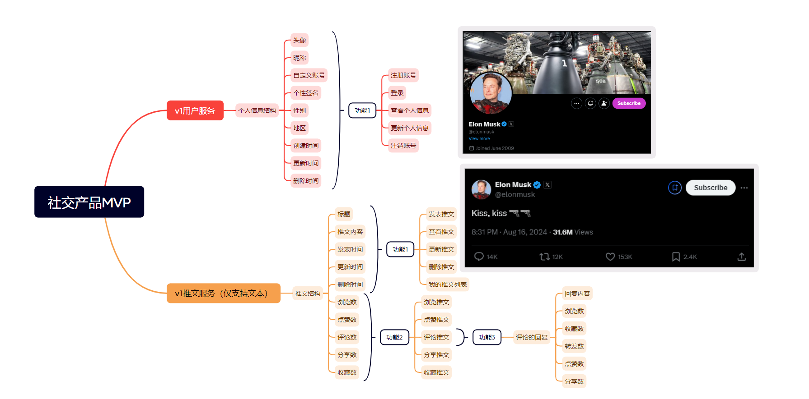

# go-zero-demo

```
基于go-zero框架的社交产品demo,仅供参考、交流、学习！！！
```

## 技术架构

本项目采用 **BFF (Backend-For-Frontend) + RPC** 架构，基于 go-zero 框架构建。

```
┌─────────────┐
│    客户端    │
└──────┬──────┘
       │
┌──────▼──────┐
│  BFF 层      │  (端口 8888)
│  聚合服务     │
└──────┬──────┘
       │
┌──────▼──────┐     ┌─────────────┐
│  User RPC   │     │  Post RPC   │
│  (端口 8081) │     │  (端口 8082) │
└─────────────┘     └─────────────┘
                          │
                    ┌─────────────┐
                    │  Like RPC   │
                    │  (端口 8083) │
                    └─────────────┘
```

## 项目结构

```
go-zero-demo/
├── bff/                    # BFF 层服务 (端口 8888)
│   ├── internal/
│   │   ├── config/         # 配置
│   │   ├── handler/        # HTTP 处理器
│   │   ├── logic/         # 业务逻辑
│   │   ├── svc/            # 服务上下文
│   │   └── types/          # 请求/响应类型
│   ├── etc/                # 配置文件
│   └── bff.go              # 入口文件
│
├── user/                   # 用户服务 RPC (端口 8081)
│   ├── internal/
│   │   ├── config/         # 配置
│   │   ├── logic/          # 业务逻辑
│   │   ├── model/          # 数据模型
│   │   ├── server/         # RPC 服务器
│   │   └── svc/            # 服务上下文
│   ├── user/               # Protobuf 生成代码
│   ├── etc/                # 配置文件
│   └── user.go             # 入口文件
│
├── post/                   # 推文服务 RPC (端口 8082)
│   ├── internal/
│   │   ├── config/
│   │   ├── logic/
│   │   ├── model/
│   │   ├── server/
│   │   └── svc/
│   ├── post/               # Protobuf 生成代码
│   ├── postclient/         # RPC 客户端
│   ├── etc/
│   └── post.go
│
├── like/                   # 点赞服务 RPC (端口 8083)
│   ├── internal/
│   │   ├── config/
│   │   ├── logic/
│   │   ├── model/
│   │   ├── server/
│   │   └── svc/
│   ├── like/               # Protobuf 生成代码
│   ├── etc/
│   └── like.go
│
├── pkg/                    # 公共包
│   ├── auth/               # JWT 认证
│   ├── cache/              # 缓存工具
│   ├── consts/             # 常量定义
│   ├── interceptor/         # 拦截器
│   ├── middleware/         # 中间件
│   ├── response/            # 统一响应
│   ├── regexp/             # 正则工具
│   ├── upload/             # 文件上传
│   ├── utils/             # 通用工具
│   └── xerr/              # 错误定义
│
├── doc/                    # SQL 脚本
├── assets/                 # 静态资源
├── Makefile               # 构建脚本
└── version                # 版本号文件
```

## 服务说明

### 1. 用户服务 (User RPC)
- **端口**: 8081
- **功能**:
  - 用户注册 (账号密码)
  - 用户登录 (返回 JWT Token)
  - 查看用户信息
  - 更新用户信息
  - 用户注销

### 2. 推文服务 (Post RPC)
- **端口**: 8082
- **功能**:
  - 发表推文
  - 查看推文
  - 更新推文
  - 删除推文
  - 获取用户推文列表
  - 批量获取推文

### 3. 点赞服务 (Like RPC)
- **端口**: 8083
- **功能**:
  - 点赞
  - 取消点赞
  - 获取推文点赞列表

### 4. BFF 层
- **端口**: 8888
- **功能**:
  - 聚合后端 RPC 服务
  - 提供 HTTP API
  - JWT 认证
  - 文件上传

## 快速开始

### 环境要求
- Go >= 1.21
- MySQL >= 8.0
- Redis >= 6.0
- Etcd >= 3.5

### 配置

复制 `.env.example` 为 `.env` 并配置：

```bash
cp .env.example .env
```

或设置环境变量：
```bash
export DB_DSN="root:password@tcp(127.0.0.1:3306)/social?charset=utf8mb4&parseTime=true"
export REDIS_HOST="127.0.0.1:6379"
export ETCD_HOST="127.0.0.1:2379"
export JWT_SECRET="your-secret-key"
```

### 构建

```bash
# 构建所有服务
make build

# 或分别构建
make build-bff
make build-user
make build-post
make build-like
```

### 运行

```bash
# 启动各服务
./bff -f etc/bff-api.yaml
./user -f etc/user.yaml
./post -f etc/post.yaml
./like -f etc/like.yaml
```

## 版本管理

项目使用语义化版本 (SemVer)。

```bash
# 查看当前版本
cat version

# 递增补丁版本 (1.0.0 -> 1.0.1)
make patch

# 递增次版本 (1.0.1 -> 1.1.0)
make minor

# 递增主版本 (1.1.0 -> 2.0.0)
make major

# 构建并发布
make release
```

## 社交产品 MVP 版本

> 在线实时文档：https://www.yuque.com/ngyhd/sdqiox/hkcfrvfous3wxu8v

### 用户服务详细需求

#### 1. 注册功能
- 账号6-16位，支持数字、大小写字母和特殊字符 `_`，且必须以英文字符开头
- 密码必须8-32位，支持大小写字母和数字

#### 2. 登录功能
- 支持账号密码登录，登录成功后返回 JWT Token

#### 3. 个人信息
- 查看个人信息：头像、昵称、个性签名、性别、地区
- 更新个人信息：头像、昵称、个性签名、性别、地区

#### 4. 注销功能
- 用户可申请注销，7天内未登录则自动注销
- 已注销用户：昵称显示"已注销"，头像显示默认官方头像

### 推文系统详细需求

#### 功能1：推文
- 发表推文：最大长度 10000 字符，标题可选
- 查看推文：展示标题、内容、编辑时间/发表时间
- 更新推文：支持更新标题和内容
- 删除推文：物理删除
- 推文列表：按发表时间倒序排列

#### 功能2：互动（规划中）
- 浏览量：进入详情页 +1，24小时内同一用户多次浏览只累计1次
- 点赞：点赞 +1，取消点赞 -1
- 评论：无限层级评论（规划中）
- 分享：分享 +1，24小时内同一用户多次分享只累计1次（规划中）
- 收藏：收藏 +1，取消收藏 -1（规划中）



## License

MIT License
